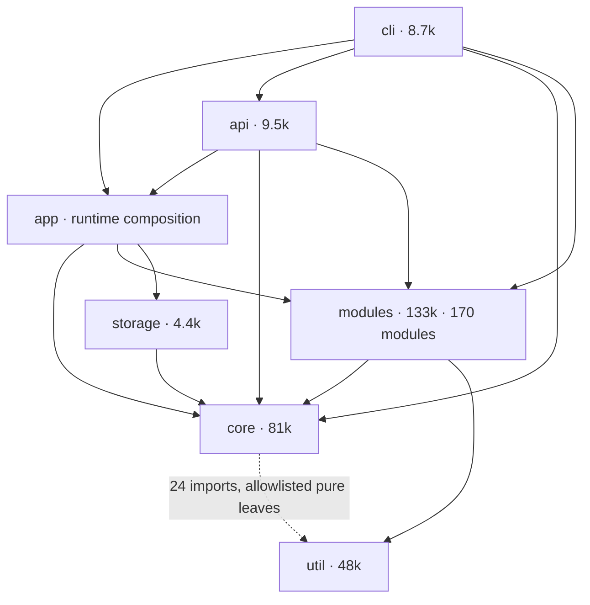
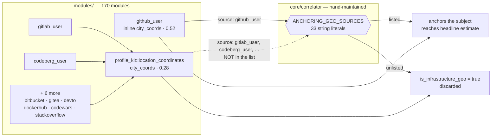

# Architecture Analysis — Phase 1

Evidence-first inventory of the `hse` codebase, produced **before** any
implementation, to identify inefficiencies and consolidation opportunities and
to rank architectural work by impact.

Written under [`OPERATIONAL_CONSTITUTION.md`](OPERATIONAL_CONSTITUTION.md):
observation is separated from inference throughout, every claim names the
command or file that produced it, and measurements that turned out to be
unsound are retracted in place rather than quietly dropped.

Scope note: this analysis is about **performance, precision and adaptability**.
It proposes no artificial-intelligence, machine-learning or large-language-model
capability, and the architecture test `runtime_carries_no_ai_ml_inference_dependency`
already enforces that boundary at the dependency level.

---

## 0. Summary

The codebase is structurally healthy: layering is clean and guarded (§2.1),
identifier derivation is properly single-sourced (§4), and component discovery
already exists as a real `ModuleGraph` with reachability proofs (§4). The
problems are **not** where an architecture review usually finds them.

They are all one shape: **170 modules declare what they do, and central
components maintain a second, hand-written copy of that same knowledge.** When
the two disagree, nothing fails — the system silently produces worse
intelligence.

Three instances, ranked:

| # | Finding | Status | Impact |
| --- | --- | --- | --- |
| §3.1 | Eight modules' person-location coordinates are discarded as "infrastructure" because their names were never added to a 33-entry allowlist. `github_user`, doing the identical thing, is listed. | **Observed**, witness test committed | Wrong location for any subject without a GitHub profile |
| §3.2 | `name_tokens` has five implementations and four behaviours. OFAC screening returns "no match" for `Li Wu` against an exactly-matching record — and reports it identically to a genuine clear. | **Observed**, executed under `rustc -O` | Unscreenable names in sanctions matching |
| §3.3 | `produces()` can over-declare with nothing to catch it, and cannot be statically verified because entity construction has four distinct factory paths. | **Observed** | Misorders budgeted dispatch via the convex query value |

Three things this analysis deliberately does **not** recommend, having tested and
rejected each:

- **Deriving capability from MITRE ATT&CK** — `T1591.001` is claimed by both
  person-geo and infrastructure-geo modules, so it cannot discriminate (§3.1).
- **Unifying `name_tokens` onto a single threshold** — OFAC's stricter floor is
  documented and correct; erasing it would trade a miss for a false positive in
  sanctions screening (§3.2).
- **Indexing the correlator's `RuleContext`** — the obvious optimisation given
  124 re-scan sites, but the profiler shows the pass is linear and its cost
  diffuse (§3.5). Withdrawn on measurement.

Section 6 retracts two of my own measurements that were wrong.

---

## 1. Method and evidence standard

Three classes of statement appear below, always labelled:

| Label | Meaning |
| --- | --- |
| **Observed** | Direct output of a command or a quoted line of source. Reproducible. |
| **Inferred** | A conclusion drawn from observations. The reasoning is shown so it can be challenged. |
| **Unverified** | Stated because it matters, but not yet demonstrated. Never presented as fact. |

Retractions are kept visible (§6). A measurement that produced a wrong number
is more useful documented than deleted, because the same trap catches the next
reader.

---

## 2. Inventory — scale and shape

**Observed** (`find src -name '*.rs' | xargs wc -l`, 2026-08-01):

| Band | LOC | Files |
| --- | ---: | ---: |
| `modules/` | 133 006 | 469 |
| `core/` | 81 073 | 162 |
| `util/` | 48 419 | 191 |
| `api/` | 9 494 | 20 |
| `cli/` | 8 719 | 30 |
| `storage/` | 4 442 | 7 |
| `audit/` | 1 184 | 5 |
| `selftest/` | 1 116 | 3 |
| **total `src`** | **299 988** | **920** |
| `tests/` | 10 864 | — |

`web/` reports 0 `.rs` because the SPA is HTML/CSS/JS embedded via
`include_str!`/`include_bytes!`.

**Observed** — 178 entries under `src/modules/`, 170 implementing the `Module`
trait, registered in a single `MODULE_REGISTRY: LazyLock<Vec<Arc<dyn Module>>>`
(`src/modules/mod.rs:337`).

**Observed** — the ten largest files are dominated by test modules
(`correlator/tests.rs` 9 816, `engine/tests.rs` 3 877, `search_engines/tests.rs`
2 544). The largest non-test file is `core/attack/mod.rs` at 4 629 LOC.

**Inferred** — the codebase is not suffering from a shortage of tests or from
under-modularisation. Its scale problem is *coordination*: 170 independently
authored modules that several central components must classify correctly, with
the classification maintained by hand. Sections 3.1–3.3 are all instances of
that single underlying shape.

### 2.1 Layer graph

**Observed** — counting only real `use crate::<band>::` statements outside test
files, the band dependency graph is an acyclic layering with no violations:



The dotted `core → util` edge is the one inversion, and it is deliberate:
`core_does_not_import_util_directly` permits a named list of **pure, offline,
dependency-free leaf modules** (`geohash`, `geometry`, `key_pool`, `key_roi`,
`spf::Ipv4Cidr`/`Ipv6Cidr`, the OUI classifier, …), each with a written
justification at the carve-out. **Observed** — 24 such imports, all inside the
allowlist. Direct `core → storage`, `core → api`, `core → modules`,
`util → cli` and `util → modules` edges are **zero**; earlier counts suggesting
otherwise were doc-comment links, not imports.

**Inferred** — structural layering is not a problem in this codebase and needs
no work. The coupling that does cause defects is *semantic*, not structural:
`core` classifies `modules` by string-matching their source tags (§3.1), an edge
the layer graph cannot show because it carries no import.

### 2.2 The semantic coupling the layer graph cannot show



**Observed** — the same profile-location field, resolved by the same
`city_coords` lookup, reaches opposite outcomes depending only on which module's
source string happens to appear in a literal array in `core`. Detail in §3.1.

---

## 3. Findings, ranked by impact

### 3.1 Capability is declared twice and drifts silently — **highest impact**

The correlator decides what a module's output *means* using hand-maintained
allowlists of module source names. **Observed** — at least eleven such lists:

| Constant | File | Entries |
| --- | --- | ---: |
| `ANCHORING_GEO_SOURCES` | `core/correlator/rules/location/mod.rs:44` | 33 |
| `EMAIL_CONFIRMATION_SOURCES` | `core/correlator/rules/mod.rs:250` | 16 |
| `PLATFORM_SOURCES` | `core/correlator/rules/identity/account.rs:23` | 22 |
| `GEO_SOURCES` | `core/correlator/rules/geo/chain.rs:144` | 11 |
| `USERNAME_DISCOVERY_SOURCES` | `core/correlator/rules/mod.rs:232` | 8 |
| `BREACH_SOURCES` | `core/correlator/rules/breach.rs:616` | 7 |
| `IDENTITY_SOURCES` | `core/correlator/rules/identity/cluster.rs:381` | 6 |
| `USERNAME_DERIVATION_SOURCES` | `core/correlator/rules/mod.rs:227` | 4 |
| `ENRICHMENT_ONLY_SOURCES` | `core/entity/mod.rs:73` | 3 |
| `TI_SOURCES` | `core/correlator/rules/infra.rs:246` | 2 |
| `ANCHORING_GEO_SOURCES` consumers | `is_anchoring_geo_source`, `is_infrastructure_geo` | — |

`ANCHORING_GEO_SOURCES` is an **allowlist**: a `Coordinates` entity whose
corroborating sources contain none of the 33 names is classified as
infrastructure and discarded from the headline location estimate
(`is_infrastructure_geo`, `location/mod.rs:137`).

The codebase already records that this has failed repeatedly. Quoting its own
comments at `location/mod.rs:55` and `:62`:

> Omitting it would make a beaconDB fix the only wardriving-database result the
> person-anchor allowlist silently ignored.

> Because the person-anchor gate is an ALLOWLIST, omitting them made
> `is_infrastructure_geo` return true for a 20 m GPS lock on the subject's own
> phone — so AU-052/053/057/059, the headline location estimate, `coord_state`
> and AU-099 all discarded it.

#### A current, unrepaired instance

**Observed** — `github_user` builds a `Coordinates` entity by calling
`util::city_coords::city_coords(location)` on the profile's self-reported
location field, at confidence `0.52` (`github_user/mod.rs:337-340`). Its source
tag is `"github_user"`, which **is** in `ANCHORING_GEO_SOURCES`.

**Observed** — eight other modules produce the same entity from the same field
through the shared helper `profile_kit::location_coordinates`, which performs
the identical `city_coords` lookup (`profile_kit/mod.rs`), at confidence `0.28`:

```
bitbucket_user  codeberg_user  codewars_user  devto
dockerhub_user  gitea_user     gitlab_user    stackoverflow_user
```

**Observed** — none of those eight is in `ANCHORING_GEO_SOURCES`
(checked by matching each name against `location/mod.rs`).

**Inferred** — a self-reported profile location anchors the subject when it
comes from GitHub and is discarded as infrastructure when it comes from GitLab,
Codeberg, Bitbucket, Gitea, Dev.to, Docker Hub, Codewars or Stack Overflow —
despite being the same field, the same lookup and the same semantics. Three
defects compound here:

1. **Allowlist drift** — eight modules produce person-anchoring geo that the
   headline estimate cannot see.
2. **A redundant implementation of a vital function** — `github_user` hand-rolls
   inline what `profile_kit::location_coordinates` already provides.
3. **Unexplained precision divergence** — `0.52` from the inline copy versus
   `0.28` from the shared helper, for identical evidence.

#### Scope of the defect — when it actually bites

This must not be overstated. **Observed** — `profile_kit::location_coordinates`
and `github_user`'s inline copy both format to **4 decimal places**
(`profile_kit/mod.rs:156`, `github_user/mod.rs:338`) from the same `city_coords`
table, so for the same city they produce an identical value string, hence an
identical UID, hence a single merged entity carrying **both** sources.
`corroborating_sources()` returns the union (`entity/mod.rs:811`), and
`is_infrastructure_geo` passes if *any* source is allowlisted.

**Inferred** — the defect is therefore conditional, and its condition is common:

- Subject has a **GitHub profile as well** → the merged entity carries
  `github_user`, anchors correctly, and the other eight are along for the ride.
- Subject has **only** a GitLab / Codeberg / Bitbucket / Gitea / Dev.to /
  Docker Hub / Codewars / Stack Overflow profile → every corroborating source is
  unlisted, and the coordinate is discarded as infrastructure.

**Observed** — `geocode` does not rescue the second case: it formats to **six**
decimal places (`geocode/mod.rs:171`), so its entity has a different value
string and a different UID and never merges with the 4 dp one.

**Inferred** — the failure mode is "subject is a developer who does not use
GitHub", which is not an edge case. It also means the bug is invisible in
exactly the scans most likely to be used for testing, since a GitHub-having
subject masks it entirely.

**Unverified** — I have not executed a full scan demonstrating the drop
end-to-end against a live provider. An engine-level test would close that.

#### Witness test — executed

`core/correlator/rules/location/tests.rs::profile_location_anchors_only_for_allowlisted_platforms`
pins the classification step. It asserts the *current, defective* behaviour on
purpose: `github_user`'s profile coordinate anchors, and the same entity under
each of the eight other source tags is classified as infrastructure.

**Observed** — it passes, which is the confirmation:

```
test core::correlator::rules::location::tests::profile_location_anchors_only_for_allowlisted_platforms ... ok
test result: ok. 1 passed; 0 failed
```

§3.1 is therefore **Observed**, not inferred, at the classification step. When P1
lands, those eight assertions must flip to `assert!(!…)` — and the flip is the
proof the fix took effect rather than merely compiling.

#### Why ATT&CK does not solve it on its own

The natural hypothesis is that `attack_techniques()` already encodes the
person-versus-infrastructure distinction and the allowlist could be derived from
it. **Observed** — it does not:

| Technique | Anchoring modules (n=27) | Infrastructure-geo modules (n=13) |
| --- | ---: | ---: |
| `T1591.001` Physical Locations | 21 | 11 |
| `T1591.002` Business Tempo | 13 | 10 |
| `T1590.005` IP Addresses | 2 | 11 |

The anchoring column is the full `ANCHORING_GEO_SOURCES` membership. The
comparison column is a hand-picked set of thirteen clearly-infrastructure geo
producers (`ipinfo`, `ip_geo`, `ip2location`, `ipquery`, `ip_whois_geo`,
`shodan`, `censys`, `netlas`, `zoomeye`, `criminal_ip`, `onyphe`, `urlscan`,
`whois`) — my selection, not a derived set, so treat the second column as
indicative rather than exhaustive. It is sufficient for the negative conclusion:
one technique claimed by both groups already refutes discrimination.

`T1591.001` is claimed by both groups and cannot discriminate. `T1590.005` is
suggestive but not clean. **Observed** — five of the 27 anchoring modules
(`geocode`, `photon`, `mylnikov`, `beacondb`, `breach_timezone`) declare no
`attack_techniques()` at all — including the two highest-traffic geo sources.

**Inferred** — ATT&CK is a valuable cross-check and a good *audit* axis, but the
person-anchoring property must become a **first-class module declaration**, not
a derivation from an ontology that was designed for a different purpose. Selling
ATT&CK as the fix here would be overfitting a framework to a problem it does not
model.

### 3.2 A vital function has five implementations and four behaviours

**Observed** — `name_tokens` is independently defined in five places:

| Location | Separator predicate | Min token length |
| --- | --- | ---: |
| `modules/asic_banned_orgs/mod.rs` | `!is_alphanumeric` | 2 |
| `modules/asic_business_names/mod.rs` | `!is_alphanumeric` | 2 |
| `modules/asic_persons/mod.rs` | `!is_alphabetic` | 2 |
| `modules/sanctions_ofac/parse.rs` | `!is_alphanumeric` | **3** |
| `util/oathnet_batch/helpers.rs` | `!is_ascii_alphabetic` | 2 |

**Observed** — the same subject name tokenises differently per module:

| Subject | `asic_business_names` | `asic_persons` | `sanctions_ofac` |
| --- | --- | --- | --- |
| `Li Wu` | `["li","wu"]` | `["li","wu"]` | `[]` |
| `Jo Ng` | `["jo","ng"]` | `["jo","ng"]` | `[]` |
| `R2 Holdings` | `["r2","holdings"]` | `["holdings"]` | `["holdings"]` |

**Observed** — `sanctions_ofac::record_name_matches` returns `false` when the
token vector is empty (`parse.rs`).

**Observed** — executing the four implementations verbatim under `rustc -O`
(scratch harness, real `str::split`/`char::is_alphanumeric` semantics, not a
simulation) confirms the consequence:

```
record_name_matches("LI WU",         tokens("Li Wu"))         = false
record_name_matches("ERIK DIEGMANN", tokens("Erik Diegmann")) = true
```

OFAC sanctions screening therefore **cannot match a subject named `Li Wu`
against an exactly-matching OFAC record**. Any name whose tokens are all two
characters or shorter is unscreenable.

**Important qualification.** The length-3 threshold is *deliberate and
documented* (`sanctions_ofac/parse.rs:160`):

> Stricter than the AU registers' 2-character floor — OFAC's pool is global and
> dominated by common transliterated names, so a shorter token would collide far
> more often than in a national register.

**Observed** — it is also deliberately *tested*:
`sanctions_ofac/parse_tests.rs:101::name_tokens_requires_three_chars_and_lowercases`.

**Inferred** — the defect is therefore **not** the threshold, and unifying the
five implementations onto a single 2-character floor would degrade OFAC
precision for a reason its author already anticipated and pinned. The defect is
that
`record_name_matches` returns a bare `false` for an unscreenable name: an
un-evaluated query is reported with the same value as a genuine clean result.
The consolidation must preserve the divergence, not erase it.

**Observed** — `asic_persons` splits on `!is_alphabetic`, so `R2 Holdings`
tokenises to `["holdings"]` there and `["r2","holdings"]` elsewhere, losing its
distinguishing token.

**Observed** — all five lowercase with `to_ascii_lowercase`, which does not fold
non-ASCII. Executed:

```
tokens("MÜLLER")                                    = ["mÜller"]
record_name_matches("Hans Müller", tokens("MÜLLER")) = false
record_name_matches("Hans MULLER", tokens("MULLER")) = true
```

An uppercase non-ASCII query fails against the record it exactly names, while
its ASCII-transliterated twin succeeds.

### 3.3 The producer contract cannot be verified by any current mechanism

Every module declares `produces() -> &'static [EntityKind]`. **Observed** — that
declaration feeds exactly two things (`core/dependency/mod.rs:161`, `:190`):

1. `producer_index`, used for the JSON view at `/api/v1/modules/graph`
   (presentation only);
2. `convex::module_cascade(m.produces(), m.category())`, which becomes each
   module's `query_value` and therefore its position in `convex_dispatch_index`
   — the order the engine walks when a scan runs under `ScanOptions::convex_budget`.

**Observed** — `module_cascade` takes a **max** (`core/convex/mod.rs:243`):

```rust
let from_outputs = produces.iter().map(entity_cascade).fold(0.0_f64, f64::max);
from_outputs.max(category_cascade(category)).clamp(0.0, 1.0)
```

**Inferred** — declaring one high-optionality kind the module never emits (say
`Email` or `Username`) pins its cascade to that kind's value, raises its
`query_value`, and moves it earlier in the budgeted dispatch order — displacing
a module that would actually have delivered. The effect is bounded: because the
category floor is also inside the `max`, over-declaration is inert whenever
`category_cascade` already dominates. So this misorders a constrained scan
rather than corrupting an unconstrained one.

**Correction** — an earlier draft of this section claimed over-declaration
corrupts the *richness* factor. That is wrong: richness derives from
`consumer_count`, i.e. `consumes()`, not `produces()` (`dependency/mod.rs:153`).
The planning impact is real but runs through the convex ordering described
above.

**Observed** — `tests/architecture.rs::every_literal_constructed_entity_kind_is_declared_in_produces`
guards the **under**-declaration direction, and documents itself as "SOUND, not
complete" because it inspects only literal `Entity::new(EntityKind::X` sites.

**Observed** — nothing guards the **over**-declaration direction: a module may
declare a kind it never emits, inflating its richness score and its pivot edges.

**Observed** — over-declaration also cannot be detected statically, because
entity construction has no single chokepoint. At least four distinct factory
families exist:

- direct `Entity::new(EntityKind::X, …)` in the module,
- `profile_kit::{person_from_name, location_address, location_coordinates, bio_emails, website_url_and_domain}` (20 caller modules),
- `util::geo::coarse_provider_coords` (the coarse IP-geo providers),
- `device_fix::scan_location_ladder(scan_id, SRC)` — notable as the **good**
  pattern: shared construction with the caller supplying its own source tag.

**Inferred** — `device_fix`'s signature is the shape the rest should converge
on. A single typed emission interface that records the kind as a side effect of
construction would make `produces()` a *derived* fact rather than a parallel
assertion, removing the whole defect class rather than testing for it.

### 3.4 Observability is one undifferentiated stream

**Observed** — `src/cli/logging.rs` defaults `RUST_LOG` to `trace` for the whole
crate, emitting NDJSON to stderr and to an in-memory ring buffer, deliberately:
"every curl invocation, full endpoint payload, JSON-parse step, and retry/backoff
decision is emitted without the operator having to opt in."

**Observed** — 259 log sites outside dedicated test files:

| Area | Sites | | Level | Sites |
| --- | ---: | --- | --- | ---: |
| `core` | 69 | | `warn` | 102 |
| `modules` | 65 | | `debug` | 85 |
| `util` | 65 | | `info` | 72 |
| `cli` | 27 | | `trace` | **0** |
| `api` | 22 | | `error` | **0** |
| `storage` | 10 | | | |
| `selftest` | 1 | | | |
| `app`, `audit` | 0 | | | |

**Observed** — **no site logs at `trace` or `error`.** The default filter
(`DEFAULT_RAW_LOG`) sets the crate to `trace` specifically to emit "every curl
invocation, full endpoint payload, JSON-parse step, and retry/backoff decision"
— but since nothing is *emitted* at `trace`, that setting is equivalent to
`debug`, and the lowest available level is already the default. **Inferred** —
the level dial has no travel below `debug`: an operator cannot turn verbosity
*up* past the default, and turning it down to `info` silently discards the
85 `debug` sites that carry the payload/retry detail the comment promises.
The absence of `error` is by contrast healthy — failures propagate as `Result`
rather than being logged and swallowed.

**Observed** — the `huntsman::<area>` target convention that `logging.rs`
documents is used at 8 sites (≈5%): `huntsman::shodan`, `huntsman::parser`,
`huntsman::search`, `huntsman::engine_health`, `huntsman::urlhaus`,
`huntsman::ip_reputation`, plus `selftest` and `module.urlhaus` — the last two
not even following the convention's own spelling.

**Observed** — operational telemetry does exist, but as a separate computation
rather than a log stream: `core/metrics/mod.rs` (476 LOC) exposes
`compute(entities, relations) -> ScanMetrics` and
`reachability(...) -> SeedReach`.

**Inferred** — the two audiences are genuinely mixed. A developer debugging a
parser wants the payload dump; an operator watching a Termux scan wants quota
state, module health and scan outcome, and currently has to filter TRACE-level
curl transcripts to find them. The split the directive asks for is not a
rewrite — it is a target-namespace convention (`huntsman::diag::*` versus
`huntsman::ops::*`) applied at 148 sites, with `EnvFilter` defaults that let an
operator select one plane without losing the other.

### 3.5 Correlator hot path

**Observed** — `correlate_entities` runs after **every** expansion round
(`core/engine/mod.rs:1017`). `RULES` are dispatched sequentially against a
`RuleContext` (`correlator/mod.rs:585`).

**Observed** — `RuleContext` (`correlator/mod.rs:38`) carries exactly one lazy
index, `by_canonical_handle`. Everything else is re-derived per rule: 124 call
sites take `ctx.entities()` and re-scan, with 79 `.kind == EntityKind::` filters
across 35 rule files.

**Inferred, and then refuted.** The obvious reading of the above is that ~100
rules each re-scanning the entity set must be a hot spot, and that `RuleContext`
should carry kind-bucketed indexes. I ran the existing profiler rather than act
on that reading.

**Observed** — `cargo test --lib --release correlator::perf -- --ignored`
(release, `opt-level=s -C lto -C codegen-units=1`, host x86-64):

```
correlation pass — min µs/call by entity count:
  n=  100      591.0 µs
  n=  500     3083.8 µs
  n= 1000     6494.6 µs
  n= 2000    12284.0 µs
  n= 5000    33603.9 µs

subquadratic guard: n=500 3020.1 µs, n=2000 12186.7 µs, ratio 4.04 (max 9)
```

**Observed** — the pass is **linear**: a 4× entity increase costs 4.04×. The
worst-scaling rules, ranked:

```
  RULES[ 90]  n=500:    79.70 µs   n=2000:    432.95 µs   ratio  5.43
  RULES[ 55]  n=500:    47.50 µs   n=2000:    219.67 µs   ratio  4.62
  RULES[ 54]  n=500:     8.37 µs   n=2000:     41.51 µs   ratio  4.96
  RULES[ 24]  n=500:     4.45 µs   n=2000:     19.77 µs   ratio  4.45
  RULES[ 47]  n=500:     3.27 µs   n=2000:     15.56 µs   ratio  4.75
  … 10 more, all < 15 µs at n=2000
```

**Observed** — the fifteen worst-scaling rules together account for **792 µs of
the 12 284 µs pass at n=2000 — 6.5%**. The single most expensive rule is 3.5%.
No rule dominates and no ratio approaches the 16× that would indicate a
quadratic regression.

**Inferred — P5 is not justified and is withdrawn.** Kind-bucketing
`RuleContext` would target a cost that measurement shows is diffuse and linear;
the optimisation could not recover more than a few percent, and it would add a
cache-invalidation surface to the one component where a stale view produces
wrong intelligence rather than a slow answer. The 124 re-scans are affordable
precisely because each is a cheap linear filter over a slice that stays in
cache.

**Unverified** — these are host x86-64 numbers. Termux aarch64 timings are
**not** measured (§7) and the absolute microsecond figures will differ; the
*scaling* conclusion is architectural and should carry across, but the claim
"12 ms is affordable on-device" is not one this analysis has earned.

---

## 4. What is already sound

Recording this matters as much as the findings — several things I expected to be
problems are not, and proposing to "fix" them would be waste.

- **Immutable identifiers.** `derive_uid` (`core/entity/mod.rs:1231`) is the
  single authoritative definition, with an `identity_fold` applied there rather
  than in `Entity::new`, length-prefixing for the attacker-controlled
  `Other(String)` variant, and an allocation-free `HashWrite` streaming path. The
  rationale is documented at the definition. **Observed** — one definition, six
  callers. No consolidation work is needed here.
- **Source-tag discipline.** **Observed** — 170 `const SRC` declarations; 380 of
  784 `Evidence::new` call sites use one. Comparing each `SRC` value against its
  own module directory found exactly one intentional divergence
  (`au_unclaimed/qld_helpers.rs` retains `"qld_unclaimed"` for a folded-in
  module, and `ANCHORING_GEO_SOURCES` documents why both needles are kept).
- **Component discovery.** `core/dependency/` already introspects the registry
  into a `ModuleGraph` with a dispatch index, pivot edges and a richness scalar,
  plus `reachability::fully_wired` proving every module is reachable from every
  realistic seed kind. The guard `all_target_kinds_lists_every_enum_variant`
  exists specifically because omitting `TargetKind::Ssid` once left WiGLE's SSID
  branch dead at runtime.
- **Architecture guards.** `tests/architecture.rs` holds ~50 checks — layering,
  registry/README count agreement, rule-ID uniqueness, per-rule firing tests,
  HTTP body size caps, key single-sourcing.
- **Structural layering.** **Observed** (§2.1) — zero real `use` statements
  cross the forbidden band boundaries. The single inversion, `core → util`, is a
  written allowlist of pure offline leaf modules with a per-entry justification.
  No restructuring work is warranted here, and proposing an "ownership and
  interfaces" refactor on structural grounds would be manufacturing a problem.
  The coupling that *does* cause defects carries no import at all (§2.2).
- **Platform-module consolidation.** The 20 profile-platform modules already
  share `profile_kit`. The remaining duplication there is `github_user`'s inline
  copy (§3.1), not the family as a whole.

---

## 5. Proposed work, ranked

Ranked by expected impact on intelligence quality and resilience to regression.
Nothing here has been implemented.

**P1 — Make capability a module declaration, not a correlator allowlist.**
Add a declared capability to the `Module` trait (e.g. a `GeoAnchoring` enum:
`SubjectAnchoring` / `Infrastructure` / `NotGeo`) and derive
`ANCHORING_GEO_SOURCES` from the registry. Add an architecture test that fails
when a module can emit `Coordinates` but declares no anchoring class. Fixes the
eight-module drift in §3.1 and closes the class permanently.
*Risk:* changes which coordinates reach the headline estimate. Must land with
before/after assertions on a fixture graph, not just a compile.

**P2 — Single-source `name_tokens`, preserving the deliberate divergence.**
One implementation in `util` taking the minimum length and the separator
predicate as **explicit parameters**, so each caller's policy is a declared
argument rather than an accident of which copy it inherited. `sanctions_ofac`
keeps `min_len = 3`; the AU registers keep `2`. Case-fold with `to_lowercase`
rather than `to_ascii_lowercase` so the `MÜLLER` failure in §3.2 stops being
possible in any caller.

Separately, and **not** by lowering the threshold: give
`record_name_matches` a defined behaviour when tokenisation yields nothing.
Returning bare `false` reports "not sanctioned" for a query the matcher never
actually evaluated — the same value it returns for a genuine clean result. A
short-name query should either fall back to a whole-string comparison or surface
as "unscreenable", but it must not be indistinguishable from a clear.

**P3 — Split the observability planes.** Apply `huntsman::ops::*` and
`huntsman::diag::*` targets across the 259 sites, keep the current raw default,
and give operators an `EnvFilter` preset selecting the operational plane by
target rather than by level. Fold `core/metrics` output into the ops plane so
scan health is one queryable stream.

Targets are the right axis here precisely because *levels* are not: with zero
`trace` and zero `error` sites (§3.4), severity carries almost no signal — it
separates 102 warns from 157 debug/info lines and nothing else. A target
namespace gives the two audiences an independent dial that the level cannot
provide, and does so without reclassifying a single existing call site's
severity.

**P4 — Converge entity emission on one interface.** Follow `device_fix`'s
`(scan_id, SRC)` shape so `produces()` becomes derived rather than asserted.
Largest change; do it after P1–P3 and only where it pays.

**P5 — ~~Index `RuleContext` by kind.~~ Withdrawn.** The profiler was run before
this item was written up (§3.5): the correlation pass is linear (4.04× for a 4×
entity increase) and the fifteen worst-scaling rules account for 6.5% of it.
There is no hot spot to remove. Recorded here rather than deleted, so the next
reader does not re-derive the same plausible-but-wrong hypothesis from the same
124 re-scan sites.

---

## 6. Retractions

Three claims in this analysis were wrong and were corrected. All are recorded
because the traps are easy to fall into again.

1. **`grep -h` defeats path filters.** An initial tally of `Evidence::new` first
   arguments used `grep -rhn`; `-h` strips the filename, so the subsequent
   `grep -v '/tests\.rs'` filtered on line *content* and excluded nothing. The
   run reported 49 uses of `"oathnet_pro"` and apparent three-way spelling drift
   (`oathnet_pro` / `oathnet` / `oathnet-pro`). Re-run with the path retained,
   the real figure is 1 production call site and no meaningful drift. The
   "identifier drift" hypothesis it suggested was abandoned.

2. **Truncating at `#[cfg(test)]` mis-parses external test modules.** A
   `produces()`-versus-emissions audit stripped everything after
   `#[cfg(test)] mod tests`, intending to drop inline test blocks. Modules with
   an external `tests.rs` write `#[cfg(test)] mod tests;` as a *declaration* near
   the top of the file — `github_user/mod.rs:21`. The audit therefore discarded
   ~95% of those files and reported `github_user` as emitting only
   `Credential, Email`. Its "31 modules over-declare" table was unsound and is
   withdrawn. The corrected run (inline `mod tests {` only, plus known factory
   resolution) reports 37 modules with at least one undiscoverable construction
   path — and that figure is *still* an upper bound, because the factory list is
   not exhaustive. This is the evidence for §3.3's conclusion that static
   verification of the producer contract is not achievable in the current design.

3. **`produces()` does not drive richness.** An earlier draft of §3.3 asserted
   that over-declaring a kind corrupts the expansion ranker's *richness* factor.
   Tracing the field to its use shows richness derives from `consumer_count` —
   built from `consumes()`, not `produces()` (`dependency/mod.rs:153` vs `:161`).
   The real planning impact runs through `convex::module_cascade` into the
   budgeted dispatch *order*, and is bounded by the category floor inside that
   function's `max`. The corrected mechanism is in §3.3; the finding survived,
   its stated cause did not.

Two further hypotheses were tested and **refuted** rather than retracted — they
were never asserted as fact, but they are worth recording because each is the
obvious first guess: deriving the geo allowlist from ATT&CK (§3.1), and indexing
`RuleContext` to remove the 124 re-scans (§3.5, refuted by profiler output).

---

## 7. Limits of this analysis

- **No aarch64 verification.** This container cannot build the
  `aarch64-linux-android` target (`ring` requires the Android NDK). Every claim
  here is from source inspection and host-target execution. Termux behaviour is
  **Unverified**.
- **Static call-graph resolution is incomplete.** The factory inventory in §3.3
  was assembled by reading; a module could construct entities through a path not
  listed. Counts derived from it are upper bounds on declaration gaps.
- **No live-network evidence.** Drift tests against real providers are
  `#[ignore]`d by default and were not run.
- **Runtime cost figures are host x86-64 only.** §3.5's numbers come from
  `cargo test --release correlator::perf -- --ignored` on this container. The
  *scaling* conclusion (linear, no hot spot) is architectural and should carry to
  aarch64; the absolute microsecond figures will not, and no claim about on-device
  wall-clock is made.
- **§3.1 is proven at the classification step, not end-to-end.** The witness test
  demonstrates `is_infrastructure_geo` discards the eight modules' coordinates.
  It does not execute a full scan, so the downstream consequence for the headline
  estimate is **Inferred** from the call sites, not observed.

---

## 8. Reproducing this analysis

```sh
# §3.1 witness — passes today, must flip when P1 lands
cargo test --lib --locked profile_location_anchors_only_for_allowlisted_platforms

# §3.5 correlator scaling and per-rule cost
cargo test --lib --locked --release correlator::perf -- --ignored --nocapture

# §2.1 layer graph — should print nothing
grep -rn "^\s*use crate::\(storage\|api\|modules\)::" src/core --include='*.rs' | grep -v '/tests\.rs:'

# §3.2 tokeniser divergence
grep -rn "fn name_tokens" -A 6 src/modules src/util --include='*.rs' | grep -v _tests

# §3.4 log-site census
grep -rn '\(tracing::\)\?\(trace\|debug\|info\|warn\|error\)!(' src --include='*.rs' | grep -v '/tests\.rs:' | wc -l
```
