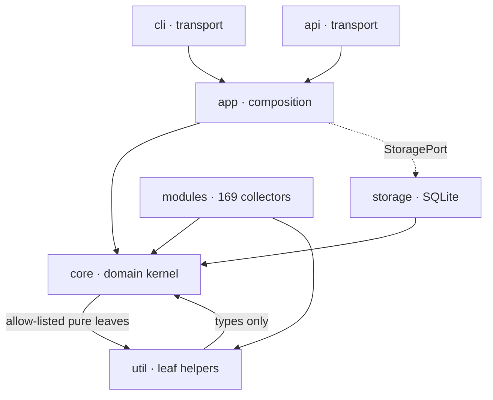

# Architecture Analysis & Consolidation Ledger

**Method:** methodical, evidence-first engineering. Inventory and graph the
system *before* altering it; prioritise by architectural impact; refactor toward
a single authoritative implementation per capability; never regress a
higher-priority objective for a lower one.

**Priority order (higher never sacrificed for lower):**
Correctness → Architectural integrity → Simplicity → Maintainability →
Observability → Reliability → Performance → Scalability → Intelligence quality →
Convenience.

> This is a living evidence document. Numbers are measured from the tree at the
> time of writing (`find … | wc -l`, `grep`), not estimated. When they drift,
> re-measure — don't trust the prose.

---

## 1. Component inventory (measured)

Per top-level subsystem, Rust LOC and file count (`src/`):

| Subsystem | LOC | files | Role |
|-----------|-----:|-----:|------|
| `modules` | 132,006 | 465 | 169 collection modules behind one `Module` trait |
| `core`    | 81,056 | 164 | domain kernel: engine, entity/relation model, correlator, exports |
| `util`    | 48,419 | 191 | leaf helpers (pure algorithms, HTTP, settings, key pool) |
| `app`     | 12,276 | 29 | composition layer (owns concrete SQLite + engine assembly) |
| `cli`     | 8,520 | 30 | CLI transport/presentation |
| `api`     | 9,253 | 20 | HTTP transport/presentation |
| `storage` | 4,442 | 7 | SQLite `StoragePort` implementation |
| `audit`   | 1,184 | 5 | scan self-audit scorer |
| `selftest`| 1,116 | 3 | live self-validation |

The mass is in `modules` (collection breadth) and `core` (intelligence). That is
the correct centre of gravity for an OSINT engine, and it means **leverage lives
in shared `core`/`util` infrastructure**: a single-sourced primitive there pays
off across hundreds of call sites.

---

## 2. Dependency & coupling graph (measured)

Inter-subsystem reference counts (`grep -roE "crate::<to>"`, so it includes
doc-comment cross-links, not only `use` — read it as a *coupling magnitude*, not
an import count):

| from \ to | core | modules | util | api | app | cli | storage |
|-----------|----:|----:|----:|----:|----:|----:|----:|
| **core**    | ·   | 4   | 231 | 2   | 0   | 1   | 4   |
| **modules** | 779 | ·   | 1170| 0   | 0   | 0   | 0   |
| **util**    | 110 | 2   | ·   | 0   | 0   | 1   | 3   |
| **api**     | 211 | 20  | 65  | ·   | 14  | 0   | 5   |
| **app**     | 200 | 8   | 63  | 4   | ·   | 0   | 11  |
| **cli**     | 139 | 10  | 82  | 12  | 32  | ·   | 1   |
| **storage** | 47  | 0   | 1   | 0   | 0   | 0   | ·   |



**Enforced invariants** (`tests/architecture.rs`) that this graph must respect,
verified in CI:
- `core` must not import `modules`; must not import `storage` (uses `StoragePort`).
- `core → util` only via an explicit allow-list of **pure, leaf** helpers (~40
  named entries, each justified in-test). This is a deliberately narrow seam, not
  a free edge.
- `util` must not import the application layers (`api`/`app`/`cli`/`selftest`/
  `storage`) — but **`util → core` is permitted** (util helpers operate on
  `core::entity` types; the 110 count is real and legitimate).
- presentation (`api`/`cli`) must not import CLI internals or concrete storage.

**Reading the anomalies honestly:** the `core → api/storage/cli` cells (2/4/1)
are `[crate::api::…]` *doc-comment* cross-links inside `core`, not imports — the
architecture tests would fail on a real import. They are noise in this magnitude
metric, not layering violations.

---

## 3. Fragmentation finding: SHA-256 → hex digest

**Evidence.** Grepping every non-test SHA-256 site
(`Sha256::new()` / `Sha256::digest(`) found the *same* "hash bytes → lowercase
hex identifier" primitive hand-rolled at **nine** sites, with **no authoritative
owner** — `core::crypto` held a double-SHA base58check routine but exposed no
`sha256_hex`, and `util::hashcat` kept a *private* one only it could use:

| Site | Mints | Shape |
|------|-------|-------|
| `core::entity::derive_uid` | entity UID | incremental, `Display`-streamed (see below) |
| `core::entity` (scan-id) | scan id | incremental, multi-field |
| `core::relation::types` | relation id | incremental, `from\|kind\|to\|scan` |
| `core::live` | live id | single-slice, `[..16]` |
| `core::stix::det_uuid` | STIX object id | single-slice, `[..32]` |
| `util::key_pool::types` | pooled-key id | single-slice, `[..12]` |
| `util::hashcat` (private `sha256_hex`) | crack table | single-slice |
| `modules::github_user` | SSH-key fingerprint | single-slice, `[..16]` |

These mint **immutable identifiers** — exactly the artifacts that must be
computed one way, forever. Eight independent copies of a hashing primitive is a
latent correctness/architectural-integrity risk (any drift silently changes an
id namespace).

---

## 4. Consolidation executed

**Single authoritative implementation** established in `core::crypto` (the
natural owner — it already depends only on `sha2`, and every layer, including
`util`, is permitted to reach it):

```rust
pub fn sha256_hex(bytes: &[u8]) -> String;          // single-slice ids
pub fn sha256_hex_parts(parts: &[&[u8]]) -> String; // multi-field ids, no combined-buffer alloc
```

Migrated (byte-identical output — verified by the id-pinning tests, which pass
unchanged): `core::relation` id, `core::entity` scan-id, `core::live` id,
`core::stix::det_uuid`, `util::key_pool::key_id`, `util::hashcat::sha256_hex`
(now a thin adapter, keeping the local md5/sha1/sha512 family symmetric), and
`modules::github_user::ssh_fingerprint`. Seven function-local/module `use
sha2::…` blocks were removed with them.

**Deliberately NOT consolidated** (evidence-based judgement, not oversight —
consolidating these would regress a higher-priority objective):

- **`core::entity::derive_uid`** — the per-entity hot path. It streams a kind's
  `Display` straight into the hasher through a `fmt::Write` shim to stay
  **allocation-free**, and **length-prefixes** the `Other(String)` variant to
  disambiguate its preimage (a documented correctness fix). Routing it through a
  generic `&[u8]` helper would reintroduce a per-entity heap allocation
  (Performance) for a cosmetic Simplicity gain, and risk the persisted UID
  namespace (Correctness). It stays specialised, and now carries a note pointing
  at the shared primitive so the relationship is explicit.
- **`core::crypto` base58check double-SHA** — a distinct algorithm
  (`SHA-256(SHA-256(x))[..4]` checksum), used once. Not the same capability.

This is the methodical outcome: single-source the capability where it is genuinely
fragmented; preserve the one place that is deliberately, correctly different.

---

## 5. Verification

Correctness is the top objective, so the change is proven, not asserted:

- The migrated helpers are byte-identical to the incremental loops they replace
  (same bytes, same order), so every minted id is unchanged — pinned by the
  existing entity/relation/key-pool/fingerprint tests.
- Full CI parity gate: `cargo fmt --all -- --check`, `cargo test --all --locked`,
  `cargo clippy --all-targets --locked -- -D warnings`.

---

## 6. Prioritised opportunity ledger

Ranked by architectural impact × long-term value. **Honest headline: this
codebase is already unusually well-consolidated** — its commit history is dense
with `refactor: single-source …`, and the `core→util` seam is explicitly
policed. The remaining opportunities are refinements, not rescues.

| # | Opportunity | Priority axis | Impact | Status |
|---|-------------|---------------|--------|--------|
| 1 | Authoritative `sha256_hex`/`_parts` in `core::crypto` | Arch. integrity | Medium | **done (this change)** |
| 2 | Observability split — formalise *developer diagnostics* (debug bundle) vs *operational telemetry* (`/stats`, health) as two named surfaces with a shared, typed event vocabulary | Observability | Medium | proposed |
| 3 | Provenance as a first-class immutable type — the evidence chain is already immutable-ish `Vec<Evidence>`; lifting `(source, recorded_at, verification)` into a named `Provenance` value would harden the "immutable identifiers **and** provenance" invariant across exports | Arch. integrity | Medium | proposed |
| 4 | Collection breadth — new keyless modules (CommonCrawl index, `.well-known`, DNSBL) per the module contract; each a one-file addition with fixture proof | Intelligence quality | High (recall) | proposed (roadmap §4.A of `ULTIMATE_ARCHITECTURE.md`) |
| 5 | Interop push — MISP/TAXII on top of the shipped STIX 2.1 serialiser | Convenience | Medium | proposed |

Anti-goal reminder (per `SECURITY.md`): every item is defensive OSINT breadth,
depth, and interoperability — never intrusion.

---

*Change something here only after the evidence above still holds. Re-measure,
then act.*
